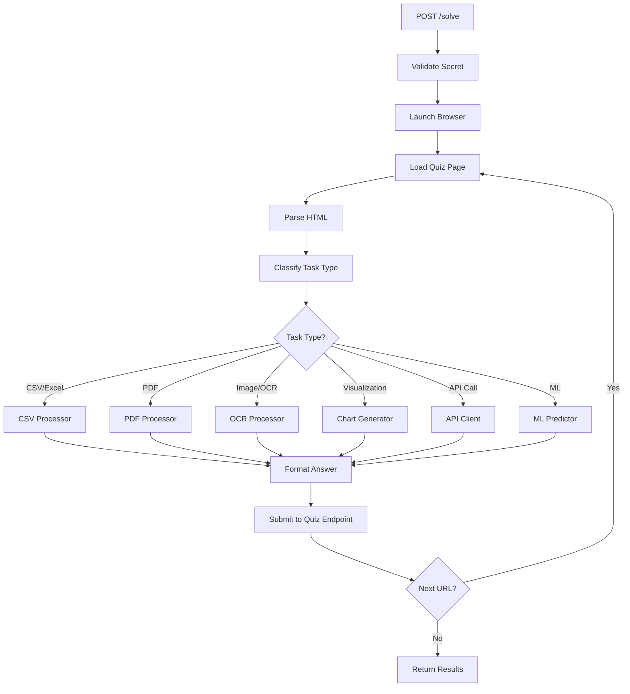

# Universal Quiz Solver API - Complete Documentation

## 🎯 Overview

The **Universal Quiz Solver API** is an autonomous agent that:
1. Receives a quiz URL via HTTP POST
2. Opens the page with a headless browser (Playwright)
3. Parses the quiz question and instructions
4. Classifies what type of task it is
5. Executes the appropriate solver (CSV, PDF, OCR, ML, etc.)
6. Submits the answer to the quiz's submit endpoint
7. Follows chain links if the quiz returns a next URL

---

## 🏗️ Architecture



---

## 📁 File Structure

| File | Purpose |
|------|---------|
| [app.py](file:///Users/utkarshgupta/Documents/aura/quiz_solver/app.py) | FastAPI server with `/solve` endpoint |
| [solver/browser.py](file:///Users/utkarshgupta/Documents/aura/quiz_solver/solver/browser.py) | Playwright browser automation |
| [solver/parser.py](file:///Users/utkarshgupta/Documents/aura/quiz_solver/solver/parser.py) | HTML parsing, extracts questions & submit URLs |
| [solver/classifier.py](file:///Users/utkarshgupta/Documents/aura/quiz_solver/solver/classifier.py) | Rule-based + Gemini task classification |
| [solver/downloader.py](file:///Users/utkarshgupta/Documents/aura/quiz_solver/solver/downloader.py) | Secure file downloads with retry |
| [solver/csv_utils.py](file:///Users/utkarshgupta/Documents/aura/quiz_solver/solver/csv_utils.py) | CSV/Excel loading, stats, groupby |
| [solver/pdf_utils.py](file:///Users/utkarshgupta/Documents/aura/quiz_solver/solver/pdf_utils.py) | PDF text/table extraction |
| [solver/ocr_utils.py](file:///Users/utkarshgupta/Documents/aura/quiz_solver/solver/ocr_utils.py) | Image text extraction (Tesseract) |
| [solver/chart_utils.py](file:///Users/utkarshgupta/Documents/aura/quiz_solver/solver/chart_utils.py) | Base64 chart generation |
| [solver/ml_utils.py](file:///Users/utkarshgupta/Documents/aura/quiz_solver/solver/ml_utils.py) | ML model inference |
| [solver/api_utils.py](file:///Users/utkarshgupta/Documents/aura/quiz_solver/solver/api_utils.py) | HTTP client + Gemini API wrapper |
| [solver/solver_core.py](file:///Users/utkarshgupta/Documents/aura/quiz_solver/solver/solver_core.py) | Main orchestration logic |

---

## 🔄 Request Flow

### 1. API Request
```json
POST /solve
{
  "url": "https://quiz-site.com/quiz-123",
  "secret": "ishank",
  "timeout": 180
}
```

### 2. Validation
- Checks `secret` matches `SOLVER_SECRET` env var
- Returns `403` if invalid, `200` if accepted

### 3. Browser Automation
- Opens headless Chromium via Playwright
- Waits for JavaScript to render
- Extracts full HTML content

### 4. Parsing
- Finds the quiz question text
- Detects file download links (CSV, PDF, images)
- Locates the submit URL ("Post your answer to...")

### 5. Classification
Uses keyword matching to detect task type:

| Keywords | Task Type |
|----------|-----------|
| sum, total, mean | Numeric calculation |
| PDF, page | PDF extraction |
| histogram, chart | Visualization |
| extract text from image | OCR |
| predict, classify | ML inference |
| call API, fetch | API integration |

### 6. Execution
Routes to appropriate solver module:
- **CSV**: Load file → compute sum/mean/groupby
- **PDF**: Extract tables or text from specific pages
- **OCR**: Preprocess image → Tesseract extraction
- **Chart**: Generate matplotlib plot → base64 PNG
- **API**: Fetch external data → merge with files

### 7. Submission
```json
POST {submit_url}
{
  "answer": <computed_answer>
}
```

### 8. Chaining
If response contains `"url": "next-quiz-url"`, repeats from step 3.

---

## ⚙️ Environment Variables

| Variable | Required | Description |
|----------|----------|-------------|
| `SOLVER_SECRET` | Yes | Secret for API authentication |
| `GEMINI_API_KEY` | No | Gemini API for AI-assisted classification |

---

## 🚀 Deployment

### Hugging Face Space
- **URL**: https://huggingface.co/spaces/IshankGupta/tds-proj-2
- **API Endpoint**: `https://ishankgupta-tds-proj-2.hf.space/solve`
- Uses Docker SDK with Playwright pre-installed

### Local Development
```bash
cd quiz_solver
pip install -r requirements.txt
playwright install chromium
uvicorn app:app --reload --port 7860
```

---

## 🧪 Testing

```bash
# Health check
curl https://ishankgupta-tds-proj-2.hf.space/health

# Solve a quiz
curl -X POST https://ishankgupta-tds-proj-2.hf.space/solve \
  -H "Content-Type: application/json" \
  -d '{"url": "https://tds-llm-analysis.s-anand.net/project2", "secret": "ishank"}'
```

---

## 📊 Supported Task Types

1. **Numeric**: Sum, mean, median, max, min, count
2. **PDF**: Table extraction, text extraction, specific pages
3. **CSV/Excel**: Load, filter, groupby, merge datasets
4. **Visualization**: Histogram, bar chart, scatter plot → base64
5. **OCR**: Extract text from images (PNG, JPG, base64)
6. **ML**: Load model.pkl, run predictions
7. **API**: Fetch external data, merge with local files
